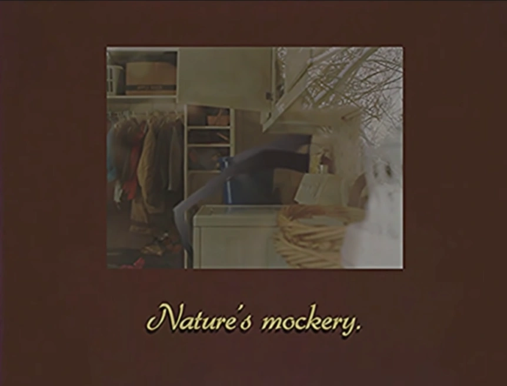
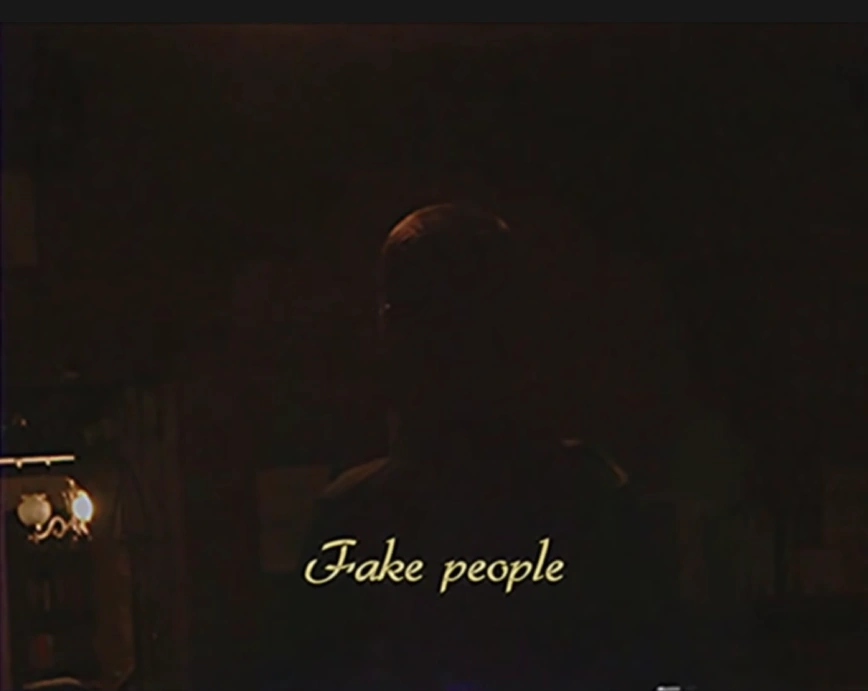
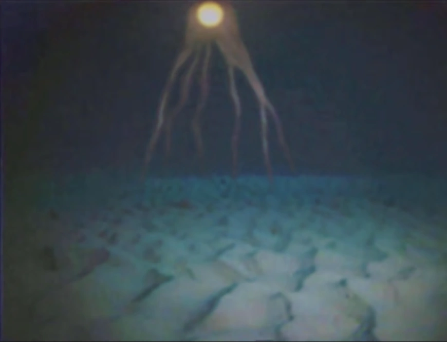
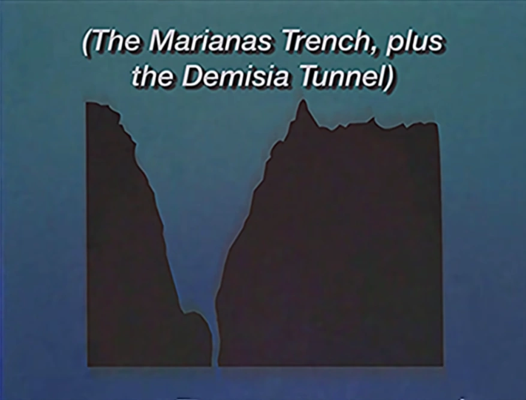
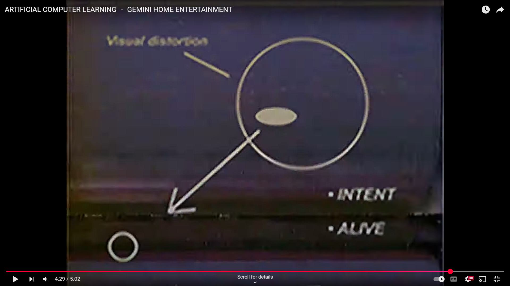
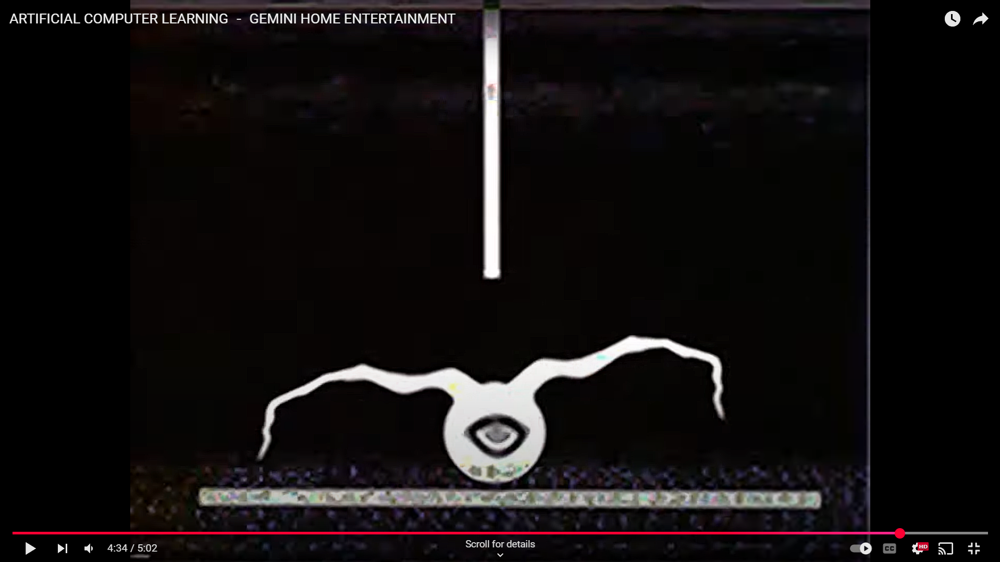

gemini home entertainment research
# WORLD's WEIRDEST ANIMALS - GEMINI HOME ENTERTAINMENT
- Rural Minnesota - entirety
- woodcrawlers
- - all over north america
- - excellent hunters
- - can go aver most terrain without making a sound
- - preferred to live in burrows beneath homes of large families where large swarms can adapt easier
- - screaming, steal voices
- - "burn the bodies, lest they stand up again"
- - distort technology
- - 
- Nature's mockery
- Fake People
- - stiff bodies
- - bad imitation of humans
- - run really fast
- - 
- clicking
- Despite being described as "Nature's Mockery", Woodcrawlers don't seems to have any relation to the 
  entity that is actually named Nature's Mockery.
- All three animals the video features are mentioned to live in or use burrows.

# STORM SAFETY TIPS - GEMINI HOME ENTERTAINMENT
- Harbinge Technologies
- 1. prepare in advance
- - step 1: reinforce your home
- - step 2: install early warning system
- - - Albedo Alarm from Harbinge Technologies
- - step 3: create a storm bunker
- - - 10ft by 18 ft
- - - 8 inches thick concrete foundation
- - - in the center a large aluminium hemisphere, diameter of 4-5 ft
- - - shortwave radio next to sphere, within 4-5 ft
- - - Timbre Radio from Harbinge Technologies
- - - **ONLY TURN ON RADIO IN THE EVENT OF AN EMERGENCY**
- 2. what to do during a storm
- - step 1: quietly take your family to your bunker.
- - - "your home does not belong to you now" <- hints at woodcrawlers coming out
- - step 2: turn on shortwave radio, sounds made by it are hallucinations.
- - step 3: remain calm, "your tears are filled with salt" <- hints at that woodcrawlers can sence salt
- 3. after a storm
- - carefully leave bunker and survey damages
- - if house is severally damaged, check for movement inside it
- - chime = safe, storm has passed
- - look at field, do you see lights. if so return to bunker
- bunch o lights show up
- listen for sounds under your feet, things be crawling under the floor
- 
- This episode has the first mention of Harbinge Technologies.
- 
- As seen in Lethal Omen, the aluminum sphere deters Woodcrawlers from entering the shelter.
- 
- Woodcrawlers are presumably attracted to salt, judging by one of the lines in Step 3.
- 
- Taking into account the fact that Woodcrawlers group together frequently, you could replace the word
  "storm" in the video with "swarm" (referring to a swarm of Woodcrawlers) and the abnormal setup for a
  bunker makes more sense.
- 
- The siren shown at the end of the video is a Whelen WS-3000, a rotational electronic siren that was 
  produced by Whelen Engineering from 1981 to 1991.
- - Based on that fact, it can be inferred that Storm Safety Tips may take place within that timeframe.
- 
- Given that “auditory hallucinations” are used elsewhere as a euphemism for the panicked screams of Fake 
  People, the video implies that the sounds produced by the radio are also screaming pleas for help. This is 
  likely intended as a last-resort defense against Woodcrawler intrusion, where the audio convinces the 
  invaders that the bunker occupants have already been converted into Fake People. This also explains why 
  the video says to only activate the radio in case of emergency, so as not to attract unnecessary attention.

# THE DEEP BLUE
-  <- wood crawler
-  <- the demise tunnel

# ARTIFICIAL COMPUTER LEARNING － GEMINI HOME ENTERTAINMENT
- REGNAD COMPUTING
- AI?
- iteration 1:
- - jack leapt over the river
- - mary to follow, together
- - travel follow the secret
- - jack the river, it is dead
- iteration 2:
- - jack leapt over the river
- - mary followed close behind
- - they are searching for the secret place
- - i hear you
- iteration 3:
- - jack leapt over the river
- - there goes mary down the stream
- - the secret place will keep us safe
- - the river flows but not with water
- iteration 4:
- - jack heard it again
- - there is a voice from space <- maybe the iris??????
- - jack do you see me
- - i have become something else
- heavy breathing in the background?
- listen to the silver box <- WTF
- the stars are moving now
- do you see the hungry eye <- the iris mentioned????
- here i am!
-  <- Intent Alive
-  <- Gardener eats
- yes ai
- The "Secret Place" seems to be the bunker from Storm Safety Tips, and the "Silver Box", the Timbre Radio.
- REGNAD is “Danger” spelt backwards.